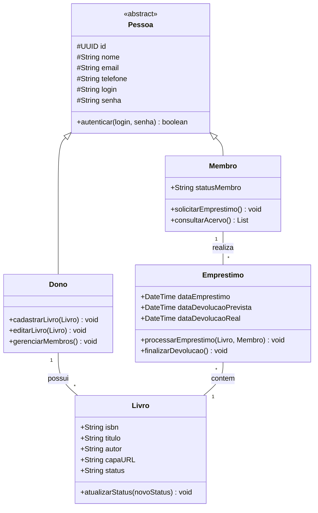

# 📚 Little Biblio

> Sistema simplificado para gestão de coleções físicas de livros.

Este protótipo é um Mínimo Viável Produto (MVP) focado na validação da lógica de acervo e empréstimos. Para acelerar a prova de valor, foram adotadas as seguintes definições de escopo:
- Acesso Aberto (Full Admin): Não há módulos de login ou cadastro. Todo usuário possui permissões totais de administrador, podendo gerenciar livros, membros e transações.
- Ambiente Único: O sistema é single-tenant, ou seja, não há separação entre diferentes bibliotecas. Todos os dados pertencem a um único contexto compartilhado.
- Foco Funcional: Itens como monetização e segurança avançada foram omitidos para priorizar a experiência de rastreabilidade e usabilidade do core do produto.

## 🛠 Stack Tecnológica

- **Front-End:** ReactJS (Interface reativa e intuitiva)
- **Back-End:** Python com FastAPI (Performance e tipagem rápida)
- **Banco de Dados:** PostgreSQL (Persistência relacional robusta)

## 📂 Estrutura do Repositório

- `/src/backend`: API REST, modelos do banco e lógica de negócio.
- `/src/frontend`: Componentes de UI e integração com a API.
- `/docs`: Documentação técnica e requisitos.
- `diagram-classes.md`: Representação visual da arquitetura do sistema.

## 🏗 Modelo de Classes (Projeto)

Abaixo está a estrutura planejada para suportar as Histórias de Usuário (HUs):

## 📋 Rastreabilidade de Requisitos

| HU       | História de Usuário                        | Classe(s)  | Método de Implementação              |
| -------- | ------------------------------------------ | ---------- | ------------------------------------ |
| **HU01** | Adicionar novo livro ao acervo             | Dono       | `cadastrarLivro(Livro)`              |
| **HU02** | Visualizar lista completa de livros        | Membro     | `consultarAcervo()`                  |
| **HU03** | Registrar empréstimo de um livro           | Emprestimo | `processarEmprestimo(Livro, Membro)` |
| **HU04** | Registrar devolução de um livro            | Emprestimo | `finalizarDevolucao()`               |
| **HU05** | "Buscar livros por título, autor ou ISBN " | Membro     | `consultarAcervo()`                  |
| **HU06** | Visualizar livros emprestados e contatos   | Dono       | `visualizarRelatorioEmprestados()`   |
| **HU07** | Gerenciar lista de membros                 | Dono       | `gerenciarMembros()`                 |
| **HU08** | Editar detalhes de um livro                | Dono       | `editarLivro(Livro)`                 |
| **HU09** | Filtrar lista por status                   | Membro     | `consultarAcervo()`                  |

## 🧪 Testes e Boas Práticas de Engenharia de Software

Este projeto foi desenvolvido seguindo princípios fundamentais da Engenharia de Software:

- **Testes Automatizados:** Utilizamos testes unitários e de integração para garantir a confiabilidade das principais funcionalidades do sistema, tanto no backend (FastAPI) quanto no frontend (React). Os testes cobrem cenários de API, modelos e componentes, favorecendo a manutenção e evolução segura do código.
- **Arquitetura Limpa:** O backend foi desenhado com inspiração na Clean Architecture, promovendo separação clara entre camadas de domínio, aplicação, infraestrutura e interfaces. Isso facilita a testabilidade, reuso e independência de frameworks.
- **Design em Camadas:** O sistema adota conceitos de arquitetura em camadas, separando responsabilidades entre modelos, serviços, roteadores e schemas. Essa abordagem favorece a organização, escalabilidade e clareza do código.
- **Separação de Classes:** As entidades principais (Livro, Membro, Emprestimo) são representadas por classes bem definidas, cada uma com suas responsabilidades e métodos, conforme boas práticas de orientação a objetos.
- **Documentação e Rastreabilidade:** O projeto inclui documentação detalhada, diagramas de classes e rastreabilidade de requisitos, facilitando o entendimento e acompanhamento do desenvolvimento.
- **Princípios SOLID e DRY:** Buscamos aplicar princípios como SOLID (responsabilidade única, aberto/fechado, etc.) e DRY (não se repita) para garantir um código limpo, modular e de fácil manutenção.

Essas práticas foram adotadas para favorecer a qualidade, robustez e evolução do projeto, alinhando-se aos objetivos da disciplina de Engenharia de Software.
