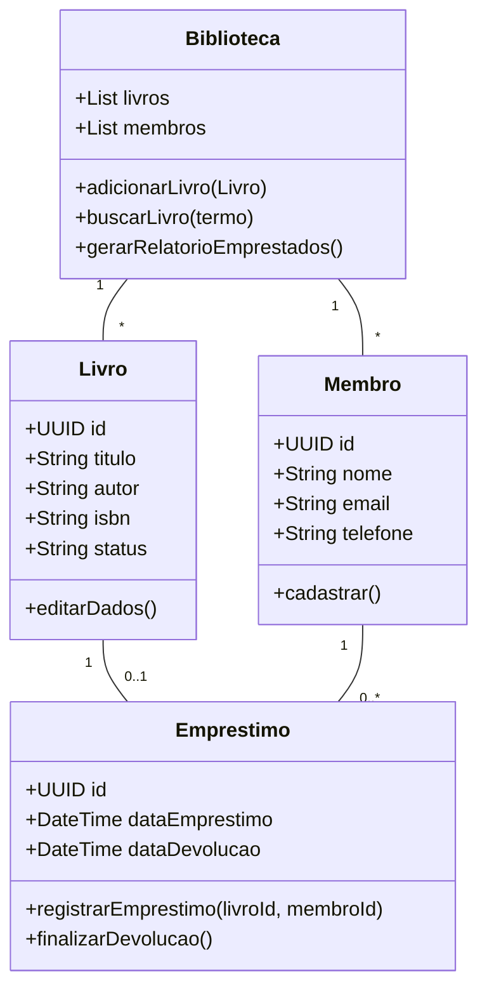

# 📚 Little Biblio

> Sistema simplificado para gestão de coleções físicas de livros.

## 🛠 Stack Tecnológica

* **Front-End:** ReactJS (Interface reativa e intuitiva)
* **Back-End:** Python com FastAPI (Performance e tipagem rápida)
* **Banco de Dados:** PostgreSQL (Persistência relacional robusta)

## 📂 Estrutura do Repositório

* `/src/backend`: API REST, modelos do banco e lógica de negócio.
* `/src/frontend`: Componentes de UI e integração com a API.
* `/docs`: Documentação técnica e requisitos.
* `diagram-classes.md`: Representação visual da arquitetura do sistema.

## 🏗 Modelo de Classes (Projeto)

Abaixo está a estrutura planejada para suportar as Histórias de Usuário (HUs):

## 📋 Rastreabilidade de Requisitos

| HU | Descrição | Método Principal (Implementação) |
| --- | --- | --- |
| **HU01** | Adicionar Livro | `Biblioteca.adicionarLivro()` |
| **HU03** | Registrar Empréstimo | `Emprestimo.registrarEmprestimo()` |
| **HU05** | Buscar Livros | `Biblioteca.buscarLivro()` |
| **HU06** | Listar Emprestados | `Biblioteca.gerarRelatorioEmprestados()` |

---
