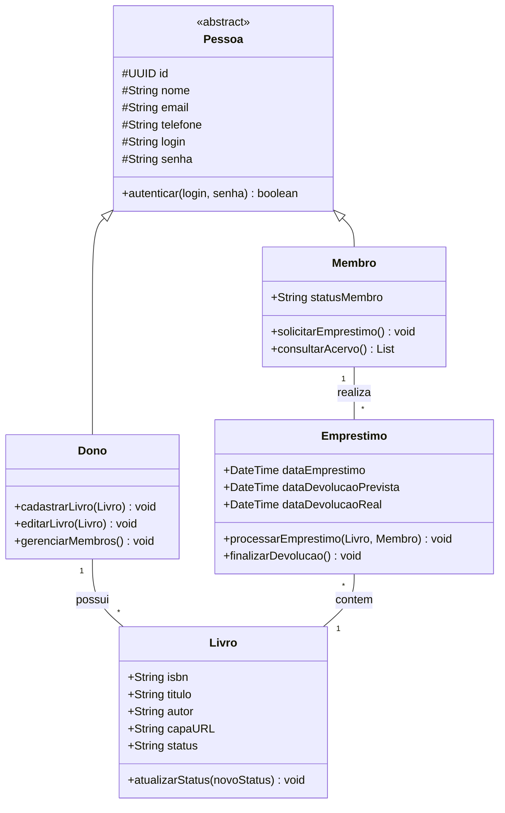

# 📚 Little Biblio

> Sistema simplificado para gestão de coleções físicas de livros.

## 🛠 Stack Tecnológica

- **Front-End:** ReactJS (Interface reativa e intuitiva)
- **Back-End:** Python com FastAPI (Performance e tipagem rápida)
- **Banco de Dados:** PostgreSQL (Persistência relacional robusta)

## 📂 Estrutura do Repositório

- `/src/backend`: API REST, modelos do banco e lógica de negócio.
- `/src/frontend`: Componentes de UI e integração com a API.
- `/docs`: Documentação técnica e requisitos.
- `diagram-classes.md`: Representação visual da arquitetura do sistema.

## 🏗 Modelo de Classes (Projeto)

Abaixo está a estrutura planejada para suportar as Histórias de Usuário (HUs):

## 📋 Rastreabilidade de Requisitos

| HU | História de Usuário | Classe(s) | Método de Implementação |
| **HU01** | Adicionar novo livro ao acervo | Dono | `cadastrarLivro(Livro)` |
| **HU02** | Visualizar lista completa de livros | Membro | `consultarAcervo()` |
| **HU03** | Registrar empréstimo de um livro | Emprestimo | `processarEmprestimo(Livro, Membro)` |
| **HU04** | Registrar devolução de um livro | Emprestimo | `finalizarDevolucao()` |
| **HU05** | "Buscar livros por título, autor ou ISBN " | Membro | `consultarAcervo()` |
| **HU06** | Visualizar livros emprestados e contatos | Dono | `visualizarRelatorioEmprestados()` |
| **HU07** | Gerenciar lista de membros | Dono | `gerenciarMembros()` |
| **HU08** | Editar detalhes de um livro | Dono | `editarLivro(Livro)` |
| **HU09** | Filtrar lista por status | Membro | `consultarAcervo()` |

---
